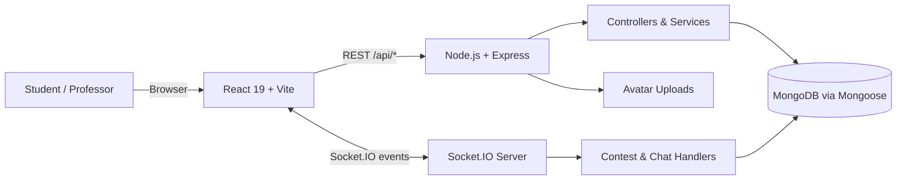

# 🎮 TCP Congestion Control Game

<div align="center">

**Learn congestion control by operating the network, not memorizing a definition.**


An interactive, queue-based networking game in the broader **TCP Edu Platform**.

[Vision](#-vision--purpose-the-why) • [Algorithms](#-core-concepts-algorithms--mathematics) • [Game Modes](#-game-modes--mechanics) • [Architecture](#-system-architecture) • [Setup](#-local-setup--installation) • [Roadmap](#-future-roadmap)

</div>

---

## 🎯 Vision & Purpose: The “Why”

Computer Science is easiest to understand when abstract rules produce visible consequences. The **TCP Congestion Control Game** turns congestion windows, bandwidth, queues, delay, and packet loss into an interactive system: a player changes a sending rate, watches packets traverse a constrained link, and immediately sees the effect on throughput and score.

This project is part of a larger vision for an educational gaming platform dedicated to **Computer Science concepts and mathematical puzzles**. Its goal is to replace rote memorization with experimentation. Instead of only reading that an overfilled queue drops packets, students can fill one, observe the loss, revise their strategy, and build an intuition that transfers back to networking theory.

### Who is it for?

| Audience | Value |
| --- | --- |
| 🎓 Students | Practice difficult networking concepts through short feedback loops and compare manual strategies with algorithm-inspired competitors. |
| 🧑‍🏫 Professors | Host real-time multiplayer contests for a class, laboratory, or club and turn an academic exercise into an engaging competition. |
| 🧪 Instructors & researchers | Demonstrate the trade-off among utilization, queueing delay, fairness, and loss with a visual simulation. |
| 🎮 Curious developers | Explore how a MERN application combines simulation state, persistence, authentication, rankings, and WebSockets. |

Professor-hosted competitions let students compete in the same configured network environment while a live leaderboard provides immediate feedback. Persistent profiles, score history, ratings, and global/friends leaderboards encourage a healthy competitive environment and make progress visible beyond a single match.

> [!IMPORTANT]
> This is an **educational simulation**, not a packet-level TCP implementation or a network benchmarking tool. The CUBIC and BBR competitors intentionally preserve the algorithms' central ideas while simplifying many details found in operating-system TCP stacks.

---

## 🧠 Core Concepts, Algorithms & Mathematics

### The network model

TCP congestion control attempts to use available capacity efficiently without injecting traffic so quickly that queues grow without bound. The central control variable is the **congestion window**, `cwnd`: the amount of data a sender may have in flight before acknowledgements arrive.

A useful first-order relationship is:

$$
\text{sending rate} \approx \frac{\text{cwnd}}{\text{RTT}}
$$

The amount of data required to keep a path fully occupied is its **bandwidth-delay product** (BDP):

$$
\text{BDP} = \text{BtlBw} \times \text{RTprop}
$$

where $\text{BtlBw}$ is bottleneck bandwidth and $\text{RTprop}$ is the path's round-trip propagation time without queueing. A window much smaller than the BDP underutilizes the path; a window far above the BDP accumulates packets in buffers, raises RTT, and eventually causes drops.

### 1. AIMD — Additive Increase, Multiplicative Decrease

**Purpose.** AIMD is the classic feedback strategy behind TCP congestion avoidance. It probes gently for unused bandwidth and reacts decisively when the network signals congestion. Its characteristic linear-rise, sudden-fall plot is often called a *sawtooth*.

Let $w_n$ denote `cwnd` during control interval $n$, let $\alpha > 0$ be the additive step, and let $0 < \beta < 1$ be the multiplicative factor:

$$
w_{n+1} =
\begin{cases}
w_n + \alpha, & \text{if no congestion is detected} \\
\max(w_{\min},\, \beta w_n), & \text{after a congestion signal}
\end{cases}
$$

In a packet/ACK-oriented form, an implementation may increase the window by approximately $\alpha / w$ per acknowledgement, accumulating to roughly $\alpha$ per RTT:

$$
w \leftarrow w + \frac{\alpha}{w} \quad \text{for each ACK}
$$

**How to read the parameters:**

- **Additive step $\alpha$:** controls exploration. A larger step discovers spare capacity faster but is more likely to overshoot.
- **Drop factor $\beta$:** controls retreat. With $\beta=0.5$, a congestion event halves `cwnd`; a larger $\beta$ retains more throughput but drains the queue less aggressively.
- **Congestion signal:** traditionally inferred from loss or duplicate ACKs; modern schemes may also incorporate explicit congestion notification or delay.

When several flows use compatible AIMD behavior, multiplicative decreases pull overloaded senders back while additive increases allow bandwidth shares to converge. The player-facing controls mirror this essential decision: increase to gain throughput, hold when near capacity, and reduce before drops erase the reward.

### 2. TCP CUBIC

**Purpose.** Linear growth can be too slow on high-bandwidth, long-delay paths. TCP CUBIC makes window growth primarily a function of **real elapsed time since the last congestion event**, rather than tying growth directly to the arrival rate of ACKs. That makes probing less RTT-dependent and more scalable on high-bandwidth-delay-product networks. CUBIC is widely used in modern operating systems, notably as a Linux TCP congestion-control option/default, because it combines fast utilization growth with TCP-friendly behavior.

Its defining curve is:

$$
W_{\text{cubic}}(t) = C(t-K)^3 + W_{\max}
$$

with:

$$
K = \sqrt[3]{\frac{W_{\max}(1-\beta)}{C}}
$$

| Symbol | Meaning |
| --- | --- |
| $t$ | Real time elapsed since the most recent congestion-window reduction. |
| $W_{\max}$ | Window immediately before that congestion event—the last known capacity neighborhood. |
| $C$ | Scaling constant controlling how sharply the cubic curve grows. |
| $\beta$ | Multiplicative retention factor applied after congestion. |
| $K$ | Time needed for the curve to return to $W_{\max}$. |

After congestion, the sender reduces its window:

$$
W \leftarrow \beta W_{\max}
$$

The cubic shape then produces three intuitive regions:

1. **Fast recovery:** growth is relatively quick while the window is well below the old maximum.
2. **Cautious plateau:** the curve flattens around $W_{\max}$, where congestion previously occurred.
3. **Renewed probing:** if the path remains uncongested beyond that point, growth accelerates to search for newly available capacity.

The game uses this recognizable cubic shape for its CUBIC engine competitor, allowing students to compare a time-based automated policy with their own manual decisions.

### 3. TCP BBR — Bottleneck Bandwidth and Round-trip propagation time

**Purpose.** BBR takes a model-based approach. Rather than treating packet loss as the primary indicator of congestion, it continuously estimates two path properties:

- $\widehat{\text{BtlBw}}$: the maximum recently observed delivery rate;
- $\widehat{\text{RTprop}}$: the minimum recently observed RTT, used as an estimate of propagation delay before queueing.

It then estimates the amount of data that should occupy the path:

$$
\widehat{\text{BDP}} = \widehat{\text{BtlBw}} \times \widehat{\text{RTprop}}
$$

Conceptually, pacing and window targets are formed by applying gains:

$$
\text{pacing\_rate} = g_p \times \widehat{\text{BtlBw}}
$$

$$
\text{cwnd} = g_w \times \widehat{\text{BtlBw}} \times \widehat{\text{RTprop}}
$$

BBR periodically varies its pacing gain to probe for more bandwidth and to drain any queue created during that probe. Because it reasons about delivered bandwidth and baseline RTT, it can seek high throughput without waiting for buffer overflow to prove that the sending rate is excessive.

The educational BBR competitor keeps a rolling maximum of delivered throughput, a minimum observed latency proxy, and a repeating probe/drain gain cycle. It is intentionally a lightweight approximation of BBR's `PROBE_BW` behavior; production BBR includes additional phases and safeguards such as startup, drain, bandwidth probing, and RTT probing.

### Algorithm comparison

| Property | AIMD | CUBIC | BBR |
| --- | --- | --- | --- |
| Primary idea | Increase linearly; cut on congestion | Follow a cubic curve around the previous maximum | Estimate the path model and pace near its BDP |
| Main feedback | Congestion/loss | Time since congestion plus congestion feedback | Delivery rate and minimum RTT |
| Growth shape | Linear sawtooth | Concave, plateau, then convex | Gain-cycled probing |
| Student takeaway | Fairness and feedback control | Efficient recovery and scalable probing | Measurement-driven control without loss as the main signal |

---

## 🕹️ Game Modes & Mechanics

### Single-player practice

Single-player mode is a controlled laboratory. The player chooses a scenario, initial sending rate, queue/buffer size, game length, and optionally a CUBIC or BBR engine competitor. During each tick, the game combines the player's offered load with background traffic, admits packets to a finite buffer, drains the buffer at the current bottleneck bandwidth, and marks packets as acknowledged, queued, or dropped.

The objective is to maximize useful throughput **without repeatedly exceeding the effective bottleneck capacity**. Delivered packets earn value, while drops carry a stronger penalty. Charts and logs expose throughput, loss, normalized latency, queue behavior, the player's window, and AIMD guidance.

#### A practical single-player strategy

1. Begin below the apparent capacity and increase gradually.
2. Watch both delivered throughput and queue/latency; a full link with a rapidly growing queue is not stable.
3. Hold near the point at which throughput stops increasing.
4. Reduce early when persistent queue growth or loss appears.
5. Compare the run with CUBIC and BBR competitors and inspect why their control curves differ.

The score rewards this balance rather than raw transmission alone. In simplified form:

$$
\Delta \text{score} = r \cdot \text{delivered} - p \cdot \text{dropped} + u \cdot \text{utilization bonus}
$$

where the drop penalty $p$ is intentionally large enough to make reckless oversending unattractive.

### Multiplayer contest mode

A professor or player creates a room, configures link capacity, queue size, random-loss probability, initial window, duration, and maximum players, then shares the six-character room code. Participants join the lobby, mark themselves ready, and the host starts a synchronized countdown. During the match, Socket.IO carries score updates and leaderboard snapshots; the server owns the official start/end time and persists final ranks.

Conceptually, all contestants face the **same bottleneck-link budget and network conditions**. This creates the shared-link game-theory problem encountered by real TCP flows: every sender benefits individually from being more aggressive, but if all senders continuously raise `cwnd`, aggregate offered load exceeds capacity, the shared queue fills, and packet drops harm everyone.

Let $x_i$ be player $i$'s offered rate and $B$ the bottleneck capacity. The stable operating goal is approximately:

$$
\sum_{i=1}^{N} x_i \lesssim B
$$

For equally situated players, a simple fair-share reference is:

$$
x_i \approx \frac{B}{N}
$$

The resulting strategic tension is:

- **Aggression:** increasing `cwnd` can capture more throughput and climb the leaderboard in the short term.
- **Cooperation:** moderating load keeps the shared queue short and preserves useful capacity for everyone.
- **Tragedy of the commons:** simultaneous aggressive probing can collapse the queue into repeated overflow, turning extra transmissions into penalties instead of useful throughput.
- **Adaptive play:** a strong player probes, interprets loss and delay, and backs off rather than using a fixed rate.

> [!NOTE]
> In the current implementation, every contestant runs a local shadow queue using the host's common configuration, while the server synchronizes time and the live leaderboard. Thus the shared-queue discussion above is the networking/game-theory model being taught; a fully server-authoritative, literally shared queue and server-side packet simulation are natural hardening steps for a future release.

---

## 🏗️ System Architecture

The application follows a MERN client-server architecture with two communication paths:

1. **HTTP/REST** for authentication, profiles, game submissions/history, leaderboards, contest creation/results, message history, and file uploads.
2. **Socket.IO/WebSockets** for authenticated presence, global chat, direct messages, contest lobbies, synchronized match events, and live rankings.



### Technology stack

| Layer | Technology | Responsibility |
| --- | --- | --- |
| Frontend | React, React Router | Component UI, nested routes, authentication context, dashboards, game and contest screens. |
| Tooling | Vite | Fast development server, production bundle, and local API/WebSocket proxy. |
| Visualization | Canvas, Recharts | Packet/queue visualization and historical performance charts. |
| HTTP backend | Node.js, Express | REST API, middleware pipeline, static uploads, validation, and error responses. |
| Persistence | MongoDB, Mongoose | Users, messages, sessions, leaderboards, and contest documents. |
| Real time | Socket.IO | Authenticated chat, presence, lobby readiness, countdowns, scores, and rankings. |
| Security | JWT, bcryptjs | Token-based identity and password hashing. |

### Data and authority boundaries

- MongoDB stores durable user, game, leaderboard, message, and contest data.
- Express controllers implement request/response workflows and protect private routes with JWT middleware.
- The live contest room map and online-user presence map are currently in-process. A multi-instance deployment should move this coordination to a shared adapter/store such as Redis.
- The server is authoritative for contest timing. Current score/packet counters are client-reported and rate-limited, so high-stakes deployment would benefit from server-side simulation and validation.

---

## 💬 Chat System

The platform includes authenticated, real-time communication so learning continues around the game rather than only inside it.

### 🌍 Global chat

The floating global chat is designed for community discussion, sharing general strategies, asking conceptual questions, and finding opponents. A connecting client joins the global room and receives recent persisted history. New messages are stored in MongoDB and broadcast through Socket.IO. Users can hide a message for themselves, while authors can delete their own message for everyone.

### 🔐 Direct messages (DMs)

The dedicated DM page supports private, one-to-one interaction: discussing a specific puzzle solution, planning a contest, mentoring another student, or friendly trash-talk during a competition. Deterministic room IDs connect exactly two MongoDB user IDs, membership is checked server-side, and personal Socket.IO rooms deliver messages even when the recipient is not currently viewing that conversation. Presence indicators show which users are online; DM history, editing, and deletion events stay synchronized.

| Capability | Global | Direct |
| --- | :---: | :---: |
| Real-time delivery | ✅ | ✅ |
| Persisted history | ✅ | ✅ |
| Authenticated identity | ✅ | ✅ |
| One-to-one privacy | — | ✅ |
| Edit message | — | ✅ |
| Delete for me/everyone | ✅ | ✅ |
| Online presence | — | ✅ |

---

## 🗂️ Project Structure

```text
tcp-congestion-control-game/
├── client/                         # React/Vite browser application
│   ├── src/
│   │   ├── api/                    # REST clients and shared HTTP configuration
│   │   ├── components/
│   │   │   ├── game/               # Controls, packet grid, history canvas, metrics, results
│   │   │   ├── layout/             # Navbar, sidebar, footer, and page shell
│   │   │   └── ui/                 # Chat, rating, heatmap, review, and reusable widgets
│   │   ├── context/AuthContext.jsx # Login/session state shared by the route tree
│   │   ├── hooks/                  # Canvas and single-player simulation hooks
│   │   ├── pages/
│   │   │   ├── contest/            # Host form, real-time lobby, and contest canvas
│   │   │   └── dashboard/          # Overview, settings, games, groups, teams, blog placeholder
│   │   ├── simulation/
│   │   │   ├── gameEngine.js      # Queue physics plus AIMD/CUBIC/BBR comparison logic
│   │   │   └── contestEngine.js   # Per-player contest tick and scoring model
│   │   ├── styles/                 # Application styling
│   │   ├── App.jsx                 # React route map and global chat mounting point
│   │   └── main.jsx                # Browser entry point
│   ├── vite.config.js                 # Dev port and HTTP/upload/WebSocket proxy rules
│   └── package.json                   # Frontend dependencies and scripts
├── server/                         # Node.js/Express application
│   ├── config/                    # MongoDB connection and JWT helpers
│   ├── controllers/               # Auth, user, game, leaderboard, message, contest workflows
│   ├── middleware/                # Authentication, upload, 404, and global error middleware
│   ├── models/                    # Mongoose schemas for persisted domain entities
│   ├── routes/                    # Express /api endpoint definitions
│   ├── services/                  # Rating, activity heatmap, and history calculations
│   ├── socket/contestSocket.js    # Live room state, readiness, timers, score broadcasts
│   ├── uploads/avatars/           # Locally stored profile images
│   ├── utils/apiResponse.js       # Consistent API response envelope
│   ├── app.js                     # Express middleware, health route, and router mounting
│   ├── server.js                  # HTTP/Socket.IO bootstrap and chat/presence handlers
│   └── package.json               # Backend dependencies and scripts
├── package.json                    # Repository-level package metadata
└── README.md
```

### Frontend responsibilities

| Area | Important files | Responsibility |
| --- | --- | --- |
| Routes | `src/App.jsx`, `src/pages/**` | Maps public pages, nested dashboard views, profiles, chat, the single-player game, and the contest lifecycle. |
| Game components | `components/game/**` | Setup and control panels, packet state grid, canvas history, metrics, AIMD log, and results modal. |
| Game canvas | `pages/GamePage.jsx`, `pages/contest/ContestGameCanvas.jsx` | Composes controls, visualization, simulation ticks, keyboard input, timers, and score reporting. |
| Simulation | `simulation/gameEngine.js`, `simulation/contestEngine.js` | Keeps deterministic queue/scoring rules separate from most presentation code. |
| Socket integration | `ChatBox.jsx`, `DirectMessagesPage.jsx`, contest pages | Opens authenticated Socket.IO connections and subscribes to feature-specific events. The current project keeps these hooks close to their consuming screens rather than in a standalone socket-hook directory. |
| API layer | `src/api/**` | Centralizes the base URL and feature-specific calls for auth, games, users, messages, contests, and leaderboards. |

### Backend responsibilities and API map

All endpoints are prefixed with `/api`. 🔒 indicates that the route requires authentication.

| Method | Endpoint | Purpose |
| --- | --- | --- |
| `GET` | `/api/health` | Service health, uptime, and timestamp. |
| `POST` | `/api/auth/register` | Create a user account. |
| `POST` | `/api/auth/login` | Authenticate and issue session credentials. |
| `GET` | `/api/users` 🔒 | List users for discovery/messaging. |
| `GET` | `/api/users/profile` 🔒 | Load the signed-in user's profile. |
| `POST` | `/api/users/avatar` 🔒 | Upload a profile avatar. |
| `POST` | `/api/users/friends/:friendId` 🔒 | Toggle a friendship. |
| `GET` | `/api/users/:username` | Load a public profile (optionally enriched for a signed-in viewer). |
| `POST` | `/api/game/submit` 🔒 | Persist a completed game score/session. |
| `GET` | `/api/game/history` 🔒 | Retrieve the player's session history. |
| `GET` | `/api/leaderboard/global` | Retrieve global rankings. |
| `GET` | `/api/leaderboard/friends` 🔒 | Retrieve friend-only rankings. |
| `GET` | `/api/messages/conversations` 🔒 | List DM conversations. |
| `GET` | `/api/messages/direct/:userId` 🔒 | Retrieve one direct-message history. |
| `POST` | `/api/contests` 🔒 | Create and register a contest room. |
| `GET` | `/api/contests/:roomCode` 🔒 | Load contest metadata. |
| `GET` | `/api/contests/:roomCode/results` 🔒 | Load final contest results. |

`server/socket/contestSocket.js` owns contest events such as `join_contest_room`, readiness toggles, countdown/start, live score updates, leaderboard broadcasts, and time-up results. Chat events live in `server/server.js`: global-room history and messages, direct-room history/delivery/edit/delete, plus online presence.

---

## 🚀 Local Setup & Installation

### Prerequisites

- **Node.js 20.19+ or 22.12+** (compatible with Vite 7)
- **npm**
- A local MongoDB service or a MongoDB Atlas connection string
- Git

### 1. Clone the repository

```bash
git clone <your-repository-url>
cd tcp-congestion-control-game
```

### 2. Configure and start the backend

```bash
cd server
npm install
```

Create `server/.env` (never commit real production secrets):

```dotenv
PORT=5000
MONGO_URI=mongodb://127.0.0.1:27017/tcp_congestion_control_game
JWT_SECRET=replace-with-a-long-random-secret
JWT_EXPIRES_IN=7d
```

Start with automatic restart during development:

```bash
npm run dev
```

Or run the server directly:

```bash
node server.js
# Equivalent package script: npm start
```

The REST API and Socket.IO server will be available at `http://localhost:5000`. Verify it in another terminal:

```bash
curl http://localhost:5000/api/health
```

### 3. Configure and start the frontend

```bash
cd ../client
npm install
npm run dev
```

Open **http://localhost:5173**. The checked-in Vite development configuration proxies `/api`, `/uploads`, and `/socket.io` to `http://localhost:5000`, so no frontend environment variable is required for the standard local setup.

If the API is hosted separately, create `client/.env.local`:

```dotenv
VITE_API_BASE_URL=https://api.example.com/api
```

> [!TIP]
> Vite exposes only variables prefixed with `VITE_`. Restart `npm run dev` after changing an environment file. For same-origin local development, leave `VITE_API_BASE_URL` unset so the proxy handles both REST and Socket.IO traffic.

### 4. Production build check

```bash
cd client
npm run build
npm run preview
```

This generates the optimized client bundle in `client/dist/` and serves a local preview. A production deployment should serve that bundle from a static host (or configure Express to serve it), expose the Node server over HTTPS, use a production MongoDB deployment, restrict CORS to trusted origins, and store uploaded media in durable object storage.

### Common setup problems

| Symptom | Check |
| --- | --- |
| MongoDB connection failure | Confirm `MONGO_URI`, ensure the local daemon is running, or allow your IP in Atlas. |
| Repeated `401` responses | Confirm `JWT_SECRET` is set consistently and sign in again after changing it. |
| Chat/contest stays disconnected | Ensure port `5000` is reachable and the Vite `/socket.io` WebSocket proxy is active. |
| Browser calls the wrong API | Remove an accidental `VITE_API_BASE_URL`, or set it to a URL that includes the `/api` prefix. |
| Avatar is not visible | Confirm `/uploads` is proxied and that the backend was started from `server/` so its relative upload path resolves correctly. |

---

## 🛣️ Future Roadmap

- [ ] **Blog System:** allow students to publish articles about gameplay strategies, algorithm discoveries, experiment results, and mathematical insights, then learn from one another's experiences.
- [ ] Server-authoritative shared multiplayer queue and packet simulation.
- [ ] Redis-backed Socket.IO rooms/presence for horizontal scaling.
- [ ] Professor dashboards for cohorts, scheduled contests, assignments, and downloadable performance reports.
- [ ] Additional congestion-control algorithms, scenarios, guided tutorials, and replayable experiments.
- [ ] Anti-cheat validation, observability, accessibility improvements, and automated test coverage.

The planned blog is more than a news feed: it will turn each match into a potential learning artifact. Students will be able to explain why a strategy worked, compare CUBIC and BBR observations, publish charts, challenge assumptions, and build a community knowledge base around experimentation.

---

## 🤝 Contributing

Contributions that improve the educational model, interface, accessibility, documentation, or backend reliability are welcome.

1. Fork the repository and create a focused feature branch.
2. Install both client and server dependencies.
3. Make the change and keep simulation assumptions explicit.
4. Run the frontend production build and exercise affected API/Socket.IO flows.
5. Open a pull request that explains the learning value, implementation, and verification steps.

When changing an algorithm, document whether it is protocol-accurate or an educational approximation. Include formulas, parameter units, and test scenarios so students are not left guessing about the model.

---

<div align="center">

**Built to make congestion control observable, playable, and memorable.** 🌐

</div>
